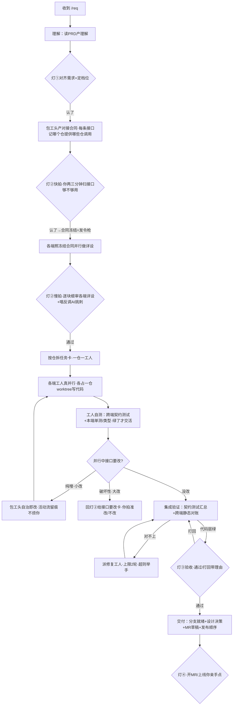

# 设计详览 · requirement 需求开发 worktype

> 给人**逐条挑刺**用，是接近交付的业务设计定稿（只差技术结构与行级实现）。全貌速览见 → 设计大纲。本文**自包含**：读它不需要再翻别的文件。

## 📍 评审重点提示（最该挑刺 3 处）
1. **多工人并行的"在途数"口径与拦截点**（§5.1）—— 这是整个改造最凶险处：并发判定按"数据库里 running 的工人 assignment"还是"运行时在途表"，口径错就超放/漏放；且拦截做在业务层（工人自己返回"等人"）而非容器层。
2. **对接合同的"按仓对齐"与"小改/大改机械判定"**（§5.3）—— 合同用"端"、工人按"仓"、过期判定用"仓"，三套维度统一到 repo key 才算得对；"小改自治 vs 大改回灯②"由合同结构比对机械判，不交给 AI 自由裁量。
3. **写代码的安全边界是"尽力拦、不拦死"**（§5.4 + §8）—— hook 能拦工具和直白的越界写，但 Bash 变量拼接路径有绕过面；要拦死得上 OS 沙箱（本次明确不依赖）。这条取决于你对 worker 写盘有多紧张。

## 目录
- §1 背景与目标
- §2 范围边界与外部契约
- §3 改动影响面（文件级）
- §4 端到端主流程
- §5 分块详细行为（按业务能力切）
- §6 判定细则
- §7 关键决策
- §8 前提与契约
- §9 验收要点

## 1. 背景与目标
现状：M0 容器（生命周期/事件/效果 outbox/监督）+ M1a kernel 能力 + probe/noop worktype + M2 流式卡已落地，能跑"单 agent 单飞调查"。但真实工作是一个人端到端扛一整个跨多端多服务的需求。本次目标：在现有底座上长出最重的 requirement worktype，让"一人扛需求"跑通——人退到 4 个决策灯，一个需求从理解到交付由系统自治推进。**硬边界**：容器改造后 probe/noop 行为逐字节不变（CI 回归），requirement 专有逻辑全在 `src/worktypes/requirement/`，不漏进容器层。

## 2. 范围边界与外部契约
- **本次做**：单需求 7 阶段 + 4 灯 + 中间自治；Owner + N Worker 真并行（一仓一工人）；对接合同（冻结+变更/返工）；集成验证（代码层）；写代码 + worktree；知识层；HTML 工作台 + 飞书灯卡。
- **本次不做**：多需求并行（上限 3 保留不堵死）；同仓竖切；bugfix/investigation；Codex；强 OS 沙箱；真实联调自动化。
- **外部契约（本设计假定、需外部满足）**：

| 谁 / 什么 | 本设计依赖它什么 | 不满足的兜底 |
|---|---|---|
| Claude CLI 的 PreToolUse hook | 路径级硬拦写操作 | 启动前探针验证，验证不过拒绝 write 档启动（§8） |
| 各 repo 的 runbook | worker 自测的构建/测试命令来源 | 缺失 → 判"测试无法执行"直接举手，不烧 retry |
| 飞书卡片 action 回调（ws 事件） | 按钮回调原语 | 文本回复兜底 |
| 公司内网穿透（如 cloudflare） | 公司外访问工作台 | 仅内网可用 |

## 3. 改动影响面（文件级）
> 函数签名等属下一阶段（见 `design/internal-apis.md`），此处只到文件级"动了哪、动多大"。

```
src/workitems/                       容器层（守红线·不解释业务）
  reducer.ts            [改] 单飞门按角色分流+在途工人计数+排队释放按角色补派；checkpoint 不碰phase
  effects.ts            [改] 在途表键 workitemId→assignmentId（真并行最大改造，连锁6+处）+测试结果门
  recovery.ts           [改] 多工人+返工同时在途的崩溃恢复，早退判定降到 per-assignment 粒度
  store.ts              [改] per-assignment 在途查询；新列走 v3 迁移
  config.ts             [改] 新增 maxWorkersPerItem（默认2）
  types.ts              [改] AssignmentSpec 加 parentAssignmentId；resolveWait 带 decision
  api.ts                [改] resolveWait 扩展携带 {approved,reason,decision}
src/agents/                          kernel（守中性·对纯桥也有意义）
  types.ts              [改] PermissionProfile 加 write 档 + writableDirs；指纹纳入目录
  claude/runner.ts      [改] buildClaudeArgs 加 write 分支（--add-dir+hook，不退化full）；加 onSession 回调
  pool.ts               [改] Semaphore 加 owner 预留槽/优先级
  (hook 注入基建)        [新] PreToolUse hook 写入与探针验证（项目当前零基建）
src/feishu/
  event-router.ts       [改] 加 card.action 事件键（走ws，只透传不解释）
  card.ts               [改] 新增 requirement 卡片构造器（4灯rail/工人面板）+标题去"调查"化；anchorAction 加新事件映射
src/index.ts            [接] registerRequirement；runRequirement 闭包（仿 runProbe）；postStatus 扩新事件
src/bridge/commands.ts  [接] /req 命令（仿 /probe，只搬运不解释）
src/worktypes/requirement/           [新] requirement 业务全在这里（纯同步worktype + 异步handler）
  index.ts              [新] WorkType 定义：7阶段 onEvent + topology(owner-workers) + 真 isDecisionStale
  run-handler.ts        [新] worker run handler（composeWorkerPrompt+write档+worktree+自测硬门+恢复）
  contract.ts           [新] 合同冻结/结构diff/影响计算/变更返工
  integration.ts        [新] 集成验证 effect（契约测试汇总+静态对账+差异报告）
  checkpoint.ts         [新] 灯的拦截与拍板推进逻辑
  worktree.ts           [新] worktree 生命周期（add/定位/脏检测/重置/回收）—— 或下沉 kernel 中性层
src/knowledge/           [新] 仓库知识层（map/conventions/runbook/pitfalls + _system 拓扑 + 保鲜）
src/workbench/           [新] HTTP 工作台（读视图SSR多页 + 事件回流写API + 鉴权）
src/worktypes/noop/      [改] 注入扩展：owner-workers拓扑 + 多角色dispatch + checkpoint（回归夹具）
tests/helpers/architecture.ts  [改] layerFor 加 knowledge/ 分层分支（前置，否则 knowledge 触禁词）
```

**复用、不改**：容器生命周期/事件/效果 outbox/watchdog 监督（多工人监督免费拿，心跳按 assignmentId 天然隔离）、ArtifactStore（每工作项 git 仓写即 commit）、ProgressCards 流式卡（每工人一张、按 assignmentId 分流）、claimThread 话题认领、managed 影子 task、桥任务路由共存、备份/停机。
**不新建**：不起前端框架、不起独立进程、不做 DSL 工作流引擎、不出现第二个叫 task 的概念。

## 4. 端到端主流程


## 5. 分块详细行为（按业务能力切）

### 5.1 多工人真并行（最凶险）
- **做什么**：一个需求按仓拆成多个工人，各占一仓 worktree，**真并行**写代码；包工头单飞协调。
- **关键行为点**：
  - 包工头自己的 run **单飞**（同一时刻至多一个）；工人 run 可并行，受"每项最多 N 个工人"（默认 2）约束。
  - **"在途工人数"按数据库里 `running` 且角色=工人的任务计数**（在事务内强一致），不看运行时在途表（那是事务后才更新、并发同帧会读到旧值导致超放）。
  - 包工头一次派 N 个工人时**逐个累加计数**判入门，不让每个各读同一份旧快照。
  - 取消/超时一个工人**只取消它自己**（按工人粒度），不误伤同需求其它在跑的工人。
  - 排队的工人被唤醒时**按角色补派对应工人**，不是补一个默认单飞 run。
- **硬约束（Must）**：包工头单飞；工人受上限；取消按工人粒度；改造守"容器不出现 phase 比较"红线。
- **不做（Never）**：不按角色之外维度分流；不在转移函数里直接调 agent（IO 一律事务后）；不破坏 probe/noop 单飞。
- 🕳️ **坑**：在途表（effects 层）当前键是"需求id"、一需求只能有一个在途，是真并行最大障碍——要改成键"工人id"，连带 6+ 处守卫/反查/回收/恢复早退都要改，漏一处就工人互相覆盖或崩溃恢复漏项。

### 5.2 包工头协调与重建
- **做什么**：包工头持需求全貌、产合同+任务卡、验收工人、做影响分析，基本不写代码；事件驱动按需唤醒。
- **关键行为点**：
  - 每次唤醒，系统给包工头一份**从结构化状态（事件/任务/合同/待办）机械生成的"现状快照"当权威输入**；journal 文件只是给人读的叙事补充，**不是真相源**，冲突时以结构化为准。
  - 多个工人在包工头运行期间先后完成，下次唤醒**一次批量带入"自上次包工头跑完以来的全部事件"**（不漏不重）。
  - 包工头收尾必须写回 journal（代码校验存在，缺失即判失败），但权威判断不押在它上。
- **硬约束**：结构化状态为权威；批次窗口取"上次跑完之后、本次跑之前"（左开右闭），**包工头运行期间到达的事件归入下一批**。
- 🕳️ **坑**：批次窗口边界（左闭右开/事件锚哪个序号）写错就重复消费（同一工人报告验收两次）或漏带（永远看不到某端交付）——必须用专门时序夹具回归"包工头运行中工人完成"。

### 5.3 对接合同（按仓对齐 + 变更/返工）
- **做什么**：包工头先冻结一份各端对接合同当发令枪与验收尺；冻结≠不可变，变更走一等流程。
- **关键行为点**：
  - 合同存工作项 git 仓 `contract/`，"冻结"语义免费拿版本史；**每条接口直接记"哪个仓提供 / 哪些仓调用"（用 repo key，不用"后端/前端"业务端名）**。
  - 改一条接口 → 据 provider/consumer 精准算出受影响的工人；受影响的返工（带"原活+接口改了哪+为何"，新任务、保留分支），**其他端照跑不停**。
  - **小改 vs 大改由合同结构比对机械判**：纯增（加字段/加接口/加可选项、不动已有签名）= 小改，包工头自治即改、不烦你但**完整留痕**（活动流标"自治·接口小改"+决策台账归"系统替我做的"，可事后批量审、可退回）；减字段/改类型/改语义/删接口 = 大改（破坏性），**强制回灯②**给"接口要改"卡。
  - **结构比对抓不到语义等价改动**（金额元→分、status 0=成功→失败、可空性/排序变）——这类要求人改契约时**人工标注"语义破坏"标志**，机械比对 + 人工标志双轨，残余靠真联调兜底。
  - 同接口反复改 2-3 次仍不定 → 举手"设计本身可能有问题"（独立计数，不和卡死重试串味）。
- **硬约束**：合同 git 化；按 repo 维度对齐；小改/大改机械判 + 语义破坏人工标；影响计算据 provider/consumer。
- **不做（Never）**：UI 像素不进合同；"小改还是大改"不交给 AI 自由裁量。

### 5.4 工人执行（写代码 + 自测硬门）
- **做什么**：工人领任务卡 + 冻结合同 + 该仓知识，在专属 worktree 写代码、自测绿了才交活。
- **关键行为点**：
  - 工人 prompt **重写系统句去掉"只读不改"**（probe 那句与写权限矛盾），喂任务卡+合同+仓知识+返工说明。
  - 跑在**写权限档**（限定目录）+ 专属 **worktree**（cwd）；可写目录与 worktree 路径**同源、同时变更**。
  - 交活前跑绿 ① 跨端契约测试 ② 本端单测+类型/编译，**绿了才交活**（不绿判失败）。
  - **区分两类不绿**：断言失败 → 重试有意义；测试根本跑不起来（命令缺失/环境/编译基础设施挂）→ **不进自动重试、直接举手**并在病历标根因（否则无限烧重试预算）。
  - 报告进工作项 git 仓、代码改动进 worktree（两套路径严格分开）。
  - 崩溃恢复：能续 session 则续（依赖补 onSession 让 session id 崩溃前已落库）；不能续则**先重置 worktree 回干净基线再重派**（写档已改盘、非幂等，盲目重跑会污染）。
- **硬约束**：单仓单任务无状态；写档+worktree；自测硬门绿了才交活；崩溃恢复回干净基线。
- 🕳️ **坑**：写档**绝不能退化成 full 档**（full=`--dangerously-skip-permissions` 无限制，会丢掉目录限定）；可写目录必须进运行指纹，否则换仓不重建 runner、写到旧目录。

### 5.5 集成验证 + 前端特殊处理
- **集成验证**：质检员拿冻结合同当标尺 —— ① 汇总各端契约测试结果（**契约测试独立于实现工人**：从冻结合同机械生成为主、质检员补语义用例，存 `contract/tests/`、灯②冻结后即生成）② 跨端静态对账（各端实现 vs 合同逐条核），产差异报告 → 对不上派修复工人（上限 2 轮、超则举手）。真实联调按需人上、非标配。
- **前端**：工人只搭到"能本地一键跑起来看"，UI 精修人主导（小改人改、大改甩回 AI）；但**人手改完 UI 后该端契约测试+类型/编译要重跑绿**（防人改破坏对接）；前端汇入灯③验收条件 = 代码层硬门绿 ∧ 人对 UI 满意。

### 5.6 4 灯关卡
- **做什么**：该人拍板处用状态机硬卡，没拍板过不去。
- **关键行为点**：
  - 拦截**做在业务层**：工人状态机检测到"将越过该挂灯的阶段边界且未拍板"时，**主动返回一个"等人"的等待、而不推进阶段**（容器完全不碰阶段，保住"容器不解释业务"红线）；拍板后状态机再推进。
  - 拍板 = 复用现有"解决等待"接口，**一个动作同时解掉等待 + 带上决定**（通过/打回 + 理由），不另起并行接口。
  - 灯②打回→回设计阶段；灯③打回→回集成验证派修复；**同一灯连拒 2 次升级对话**。
  - **拍板前校验决定是否过期**：若你拍灯②慢拍时合同已被一次自治小改触动，**拒绝拍板并重弹卡"合同已变、请重新确认"**（防你基于旧版本拍板）。
- **硬约束**：单轨（关卡=等待的一种用法，不另起双轨）；拍板原子（解等待+决定）；拦截在业务层不碰容器 phase。

### 5.7 人机交互（飞书 + 工作台）
- **飞书**：一需求一话题 + 锚点卡（4 灯 rail / 各端工人 / 决策台账）；灯是交互卡（按钮回调走长连、不起 HTTP，kernel 只透传不解释 value）；每工人一张流式卡（按工人分流、title 带仓名区分）；新卡片构造器**标题去"调查"化**（现有写死"调查·"）。
- **工作台**：进程内轻量 HTTP（不引框架）SSR，**多页拆分**（看板 / 工作台 / 审设计）；读视图复用现成数据库+artifact（活动流←事件、工人←任务、焦点卡←待办、文档←git 仓 md 就地渲染）；写路径页面按钮→既有注入门面→推进（**单写入口、页面只读投影、本人鉴权**）；任一区块为空时**空态渲染不报 500**。

### 5.8 异常、取消、提交
- **异常**：工人失败/卡死/空转复用现成监督（心跳+墙钟+deadline→重试→耗尽举手），每工人各自被监督；先自治重试、反复搞不定才举手给"病历"（卡哪/试过啥/为啥不行）不甩报错。
- **取消**：`/cancel`→确认卡防误触→取消所有在跑工人→回收 worktree（分支保留）→包工头最后写收尾 journal（半成品在哪个分支）→ cancelled 终态；**不删工作项 git 仓**（半成品是资产）。
- **提交**：写码/提交自分支自动；**开 MR/上线你亲手点**，系统只到"分支就绪 + MR 草稿/发布顺序"；平台纪律（feature 基于 prod、ff-only、MR 首行 rd:id）少量高危代码拦、大量 prompt 自律。

## 6. 判定细则

**"在途工人数"口径**（§5.1 核心）：

| 计数对象 | 一致性 | 选用 |
|---|---|---|
| 运行时在途表（effects 层 Map） | 事务后才更新，并发同帧读旧值 | ❌ 会超放 |
| 数据库 `running` 且角色=工人的任务 | 事务内强一致 | ✅ 选这个 |

**小改 vs 大改判定**：

| 变更类型 | 判定 | 处置 |
|---|---|---|
| 加字段/加接口/加可选项（不动已有签名） | 小改（纯增） | 包工头自治即改 + 留痕 |
| 减字段/改类型/改语义/删接口 | 大改（破坏性） | 强制回灯② |
| 字段名/结构没变但含义/单位/可空性/排序变 | 🕳️ 结构比对抓不到 | 人工标"语义破坏" + 真联调兜底 |

**worktree 重置策略**（细化阶段定 + 判据）：默认 `reset --hard <feature 基线>` + `git clean -fd` **仅清本工人已知产物目录、不全清**（以免误伤未跟踪有用文件）；这是改盘操作，错一次=工人真实代码产出被销毁，必须夹具验证。

## 7. 关键决策（影响业务行为的取舍）

**多工人并行首要图的是"隔离不踩踏"，不是"省墙钟"**
- 为什么：典型需求只动 2-3 仓、并行度低；按工人粒度隔离 + 取消不误伤是正确性收益（并行度=2 也成立），墙钟是次要。
- 风险：连锁改造点集中在一个数据结构、漏一处就工人互相覆盖——用 noop 夹具像当年打 outbox 那样回归锁定。
- *追溯：decisions D-01/D-10*

**写代码安全边界"尽力拦、不拦死"**
- 定了什么：`--add-dir` 声明范围 + PreToolUse hook 路径硬拦（主约束）+ 写工具集收敛；**启动前探针验证 hook 生效、不过则拒绝 write 档启动（fail-closed）**。
- 否决：退化成 full 档（无限制）；或上 OS 沙箱（那是调查类的需求、本次不依赖）。
- 风险：Bash 变量拼接路径有绕过面——标为已知残余，不假装拦死。
- *追溯：decisions D-04/D-22*

**契约过期判定靠"结构指纹预先入库"，纯同步不读文件**
- 定了什么：决定产出时把所基于的合同结构指纹固化进决定数据；合同变更事件携带结构指纹/字段级 diff——过期判定仅凭决定数据 + 事件即可纯同步判，不读文件（因为判定函数是纯同步、禁文件访问）。
- 否决：在判定函数里读 artifact 仓合同文件（做不到，纯同步禁 fs）；调 LLM（reducer 不能 await）。
- *追溯：decisions D-05/D-31*

**工人崩溃恢复要补 onSession 才有 resume**
- 定了什么：补 runner onSession 回调让 session id 崩溃前已落库，resume 分支才可达；不补则诚实退化为"重置 worktree + 全量重派"单分支。
- 否决：照搬 probe 的"直接重派"（probe 只读幂等、工人写档非幂等会污染）。
- 风险：不补 onSession 则长任务工人每次崩溃从头重跑——建议补。
- *追溯：decisions D-09/D-30*

## 8. 前提与契约
> 设计侧定不了的外部前提，需对应方确认/兜底，**不是设计缺口**。

| 前提 / 契约 | 需谁确认 | 不满足的后果 / 兜底 |
|---|---|---|
| PreToolUse hook 能注入且对 Bash 路径有效 | 实现验证（启动前探针） | 探针不过 → 拒绝 write 档启动，降级 readonly 或报人 |
| 各 repo runbook 提供可跑的测试命令 | 知识层建立时 | 缺失 → 判"测试无法执行"直接举手、不烧重试 |
| 架构红线先加 knowledge 分层分支 | 实现前置 | 不加 → knowledge 落 kernel 触发禁词、CI 红 |
| onSession 回调（决定 resume 能力） | 你拍 D-30 | 不补 → 恢复退化为重置+重派 |
| 内网穿透 | 运维 | 仅内网可用 |

## 9. 验收要点
- /req 起需求 → 锚点卡 + 工作台页可见；理解 phase（无工人）不报错（空态退化 solo）。
- 灯①认了 → 合同冻结卡；灯②快拍扫接口 → 冻结=发令枪；各端真并行起多张流式卡。
- 改一条破坏性接口 → 大改卡回灯②、只受影响端返工、其他端照跑；纯增 → 自治留痕不弹卡。
- 工人测试断言红 → 重试；测试跑不起来 → 直接举手带病历（不烧重试）。
- 集成验证对不上 → 差异报告 + 派修复（≤2 轮）；代码层绿 → 灯③；打回带理由回集成。
- 灯③通过 → 分支就绪 + MR 草稿；灯④ 开 MR 必须人点（系统不自动开）。
- `/cancel` → 确认卡 → 取消全工人 + 回收 worktree + 收尾 journal + 不删 git 仓。
- 崩溃重启 → 多工人 + 返工同时在途**全部**恢复（不漏第二个工人）。
- 端到端：一个真双端需求（1 包工头 + 后端 + 前端工人）跑通全程，验证"几个 AI 照合同并行还能拼起来"。
- CI：probe/noop 行为零回归；容器无 phase 比较；kernel 无业务词；knowledge 分层分支已加。
