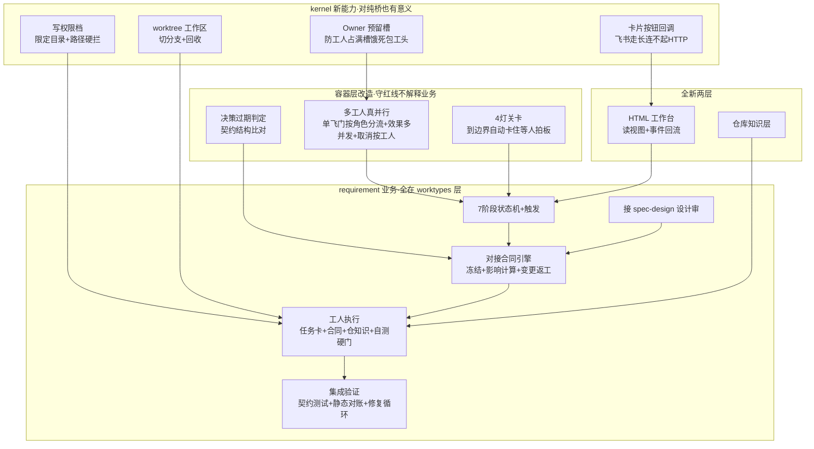
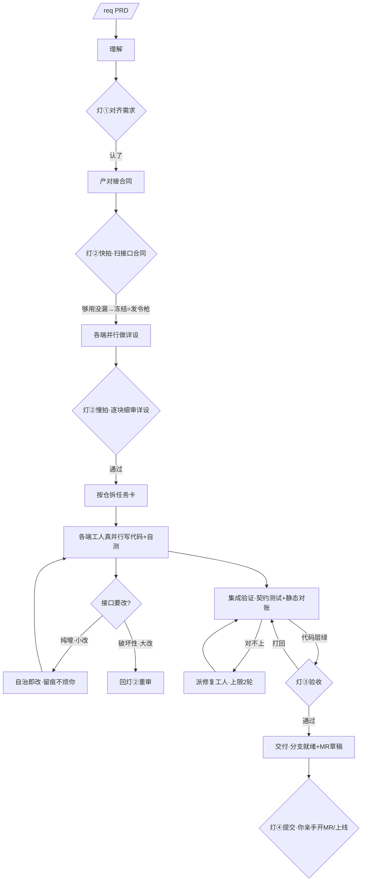

# 设计大纲 · requirement 需求开发 worktype

> 一张全貌地图：3 分钟看懂"要做什么、怎么拆、有什么坑"。逐条细节见 → 设计详览。
> **一句话**：让 agent-pipe 长出"一个人 + 这套系统 = 一个全栈工程师 + 半个 PM"——一个跨多端多服务的完整需求，人只在 4 个决策灯出场，其余系统自治推进。

## 1. 为什么做
现在 agent-pipe 的底座已经齐了：容器（生命周期/事件/效果 outbox/监督）、kernel 能力（线程路由/工具注入/排队/只读档）、probe 调查 worktype、运行中流式卡。但它还只能跑"一个 agent 单飞调查"这种最轻的活。真实工作是**一个人端到端扛一整个需求**：跨 backend/frontend 多仓改代码 + 跨项目设计。这次就在现有底座上长出最重的那一类——requirement 需求开发，把"一人扛需求"这件事跑通。

## 2. 改完之后什么样（用户视角）

| 你在哪 | 你做什么 | 系统在背后做什么 |
|---|---|---|
| 灯① 对齐需求 | 确认"要做啥" + 定流程档位（Lite/Full） | 读懂 PRD、产理解 |
| 灯② 审设计（快慢两拍） | 先两三分钟扫接口合同（=发令枪），各端详设做完再逐块细审 | 跑 spec-design：考古→规划→详设→唱反调 AI 挑刺；按端切并行 |
| 中间（不烦你） | —— | 各端工人各占一仓**真并行**写代码、自测绿了才交活；接口小改自动处理留痕；出岔子先自治重试，反复搞不定才举手给"病历" |
| 灯③ 验收 | 通过 / 打回（带理由） | 代码层先做集成验证（契约测试 + 跨端静态对账），对不上自动返工 |
| 灯④ 提交 | 开 MR / 上线**你亲手点** | 写码、提交自分支都自动；只到"分支就绪 + MR 草稿/发布顺序" |

每个需求一个飞书话题 + 一个"需求批阅台"网页（活动流/各端工人/决策台账/产物文档），灯是飞书交互卡也是网页按钮。

## 3. 范围边界（最先对齐）

| ✅ 本次做 | ❌ 本次不做 |
|---|---|
| 单需求端到端：4 灯 + 中间自治 | 多需求并行（准入上限 3 保留、不堵死） |
| Owner + N Worker 真并行（**一仓一工人**） | 同仓多工人竖切（接口不堵死，留后续） |
| 对接合同（契约先行 + 冻结 + 变更/返工） | bugfix / investigation worktype |
| 集成验证（代码层 AI 兜底） | Codex runner（继续只用 Claude） |
| 写代码 + 限定目录的 worktree | 强只读 OS 沙箱（那是调查类的需求） |
| 仓库知识层 + HTML 工作台 + 飞书灯卡 | 真实联调自动化（按需人上、非标配） |

## 4. 怎么拆（模块 + 依赖）

> **实现性质**：约六成是"接线 + 放大现成范本"（probe 是 requirement 的直接照搬范本，运行时大半零改动复用），约四成是真新建（写权限/worktree/卡片回调/知识层/工作台）。容器改造**面小但凶险**——多工人并行的连锁改造点集中在一个数据结构（效果在途表的键），漏一处就工人互相覆盖。

## 5. 主流程（一张图看懂）

## 6. 关键取舍速览（最该知道的 3 条）

1. **系统真卡住，不靠叮嘱**。该等人拍板处用状态机硬卡（到边界自动插一个"等人"的等待，没拍板过不去），不靠 prompt 提醒模型停下——ai-sentinel 最大痛点就是"LLM 自圆其说滑过流程"。这次拍板的拦截做在业务层（工人自己检测到要越界就主动返回"等人"），容器一行 phase 都不碰，保住"容器不解释业务"的红线。
2. **合同是双向标尺、按仓对齐**。对接合同既是开工发令枪、也是各端收工的验收尺；每条接口直接记"哪个仓提供、哪些仓调用"，改一条就精准算出谁返工、其他端照跑不停。"小改还是大改"由合同结构机械判（纯增=小改自治、破坏性=大改回灯②），不交给 AI 自由裁量（否则又开了"自我宽容偷工"的口子）。
3. **代码层 AI 兜到绿、真交互人上；最危险那一下留给人**。契约符合 + 本端单测/类型 + 跨端静态对账由 AI 保障至少一层、绿了才放行；跨端契约测试**必须独立于实现工人**（同一个 AI 既写实现又写验证会一致地错还照绿）。写码/提交自分支自动，**开 MR/上线必须你亲手点**（AI 自主开 MR 会误触发飞书研发任务节点）。

## 7. 前提与待确认（负责人要兜的）

| 类型 | 内容 | 谁兜 / 何时 |
|---|---|---|
| ⚠️ 待你拍 | 写代码的安全边界有多紧（hook 尽力拦 Bash 越界但有绕过面，不追求拦死；要拦死得上 OS 沙箱） | 你·决策待审 D-04 |
| ⚠️ 待你拍 | 工人崩溃恢复要不要补 onSession 回调（不补则恢复退化为"重置 worktree+全量重跑"） | 你·D-09/D-30 |
| 🔗 前置 | 知识层落地前要先给架构红线加一个 `knowledge/` 分层分支（否则会被判 kernel 触发禁词） | 实现·D-16 |
| 🔗 前置 | 写权限档要新建 hook/settings 注入基建（项目当前完全没有） | 实现·D-04 |
| 📊 实测 | 预留槽大小 / 知识保鲜阈值 / Owner 重建税——首版按经验默认上线，靠生产埋点持续校准 | 第 7 步埋点 |

## 8. 看完请确认（评审拍板点）

- [ ] 范围边界认不认可（只做按仓拆、只用 Claude、写权限不依赖沙箱）
- [ ] 灯② 拆成"快审合同 + 慢审详设"两拍这个流程切分有无异议
- [ ] 写代码安全边界的"纵深尽力拦、不追求拦死"可不可接受（D-04）
- [ ] worker 崩溃恢复补不补 onSession（D-30，影响 resume 能力）
- [ ] 工作台细化 + 多 agent 走查交互这条路（D-13，呼应你临走的补充）

> ✅ 无疑 → 进入详细设计；❌ 有异议 → **此处拦下，改动成本最低**。决策全台账见 `decisions.md`，速览见 `docs/design/2026-06-18-requirement-决策待审.md`。
