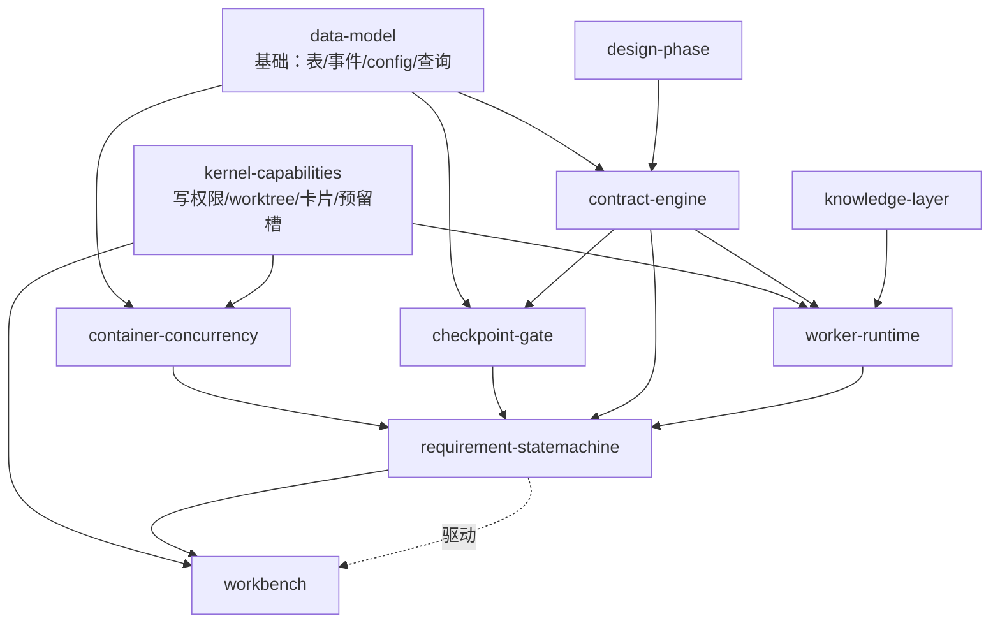

# Design: requirement worktype

> 本文档是 AI 消费的设计总文档。人类审阅请看 `../requirements.md` 和 `../decisions.md`（速览 `../design-overview.md` / `../design-detail.md`）。
> 📖 可复用资源详见 [../codebase-findings.md](../codebase-findings.md) 的 **Part B: AI Details**（含全部精确 file:line）。新增 API 契约见 [internal-apis.md](internal-apis.md)。

## 业务全貌

requirement worktype 让 agent-pipe 跑通"一个人 + 系统 = 一个全栈工程师 + 半个 PM"：一个跨多端多服务的完整需求，人只在 **4 个决策灯**（对齐需求 / 审设计 / 验收 / 提交）出场，其余系统自治。

技术构成 = **probe 范本放大**（probe 是 requirement 的直接照搬范本，运行时大半零改动复用）+ **容器补三件**（多工人真并行 / 4 灯关卡 / 决策过期判定）+ **kernel 补三件半**（写权限档 / worktree 供给 / 卡片回调 / Owner 预留槽）+ **全新两层**（仓库知识层 / HTML 工作台）。底座（M0 容器 + M1a kernel + probe/noop + M2 流式卡）已落地。

**核心命题**：心智模型唯一且连续（Owner + artifact），执行并行且即抛（Worker）。一个需求按代码仓库拆成 N 个工人，各占一仓 worktree 真并行写代码；包工头（Owner）持需求全貌、产合同+任务卡、验收工人，事件驱动按需唤醒、从结构化状态机械重建心智。"对得上"靠对接合同（逻辑一致），"踩不到一起"靠各占一仓（物理隔离）。

**生命周期（7 phase + 4 灯）**：
```
requirement: 理解 →[灯①]→ 合同 →[灯②快]→ 详设 →[灯②慢]→ 拆解 → 并行实现 → 集成验证 →[灯③]→ 交付/沉淀 →[灯④]
```
灯 = human wait 的一种用法（单轨），拍板 = 解等待 + 带决定；拦截做在 worktype 侧（主动返 wait，容器不碰 phase）。

## 核心概念与数据模型

### 概念
- **Owner（包工头）**：`role:'owner'` 的 assignment，单飞协调，结构化状态为权威输入，journal 仅叙事补充。
- **Worker（工人）**：`role:'worker'` 的 assignment，一仓一工人无状态，write 档 + worktree，自测绿了才交活。
- **对接合同（Contract）**：冻结的接口定义，每条记 providerRepo/consumerRepos，影响计算/过期判定/集成验证共用其结构 diff。
- **关卡（Checkpoint）**：phase 边界的 human wait 拦截，未拍板不得越过。
- **artifact 仓 ≠ worktree**：报告/合同/journal 进 `$DATA_DIR/workitems/<id>/`（git 仓）；代码改动进 worker worktree（cwd）。

### 数据模型（增量，复用五表）
```ts
// 新事件 kind（写 workitem_events.kind，容器不解释）—— 权威清单见 internal-apis.md §7
type RequirementEventKind =
  | 'checkpoint_reached' | 'checkpoint_decision'
  | 'contract_frozen' | 'contract_patched'
  | 'contract_change_proposed' | 'contract_change_approved' | 'contract_change_applied'
  | 'worker_report' | 'integration_check_passed' | 'integration_check_failed' | 'design_ready';

// AssignmentSpec 增 parentAssignmentId（启用父子链）；role='owner'/'worker' 投入使用
// PermissionProfile：workitems 层 {mode:'write', repos}；agents 层 {mode:'write', writableDirs}
// config 增 maxWorkersPerItem（默认 2）；新列走 user_version<3 迁移
```
合同/知识结构契约见 [internal-apis.md](internal-apis.md) §6。

## 领域划分

本次按以下 10 个领域组织（技术结构，不按 Requirement）：

| 领域 | 职责 | 层 | 文档 |
|------|------|----|------|
| container-concurrency | 多工人真并行（单飞门分流/effect 多并发/abort per-assignment）+ 父子链 + 批量唤醒 + 并发一致性恢复 | workitems | [domains/container-concurrency.md](domains/container-concurrency.md) |
| checkpoint-gate | 4 灯关卡：worktype 侧拦截 + resolveWait 带 decision + stale 校验 | workitems+worktypes | [domains/checkpoint-gate.md](domains/checkpoint-gate.md) |
| kernel-capabilities | 写权限档 / worktree 供给 / 卡片回调 / Owner 预留槽（4 件 kernel 中性能力） | kernel | [domains/kernel-capabilities.md](domains/kernel-capabilities.md) |
| requirement-statemachine | WorkType 定义 + 7 phase onEvent + 包工头快照/journal + 异常监督 + 取消收尾 | worktypes | [domains/requirement-statemachine.md](domains/requirement-statemachine.md) |
| contract-engine | 合同冻结 + 结构 diff + 影响计算 + 变更/返工 + isDecisionStale 实现 | worktypes | [domains/contract-engine.md](domains/contract-engine.md) |
| worker-runtime | worker run handler（prompt/write 档/worktree/自测硬门/恢复）+ 契约测试独立 + 集成验证 + 前端 | worktypes | [domains/worker-runtime.md](domains/worker-runtime.md) |
| design-phase | 灯②接 spec-design + 跨端一刀（快慢两拍 + Adversarial + 按端切） | worktypes | [domains/design-phase.md](domains/design-phase.md) |
| knowledge-layer | 仓库知识层（map/conventions/runbook/pitfalls + _system + 保鲜 + 选择性注入） | knowledge（新层） | [domains/knowledge-layer.md](domains/knowledge-layer.md) |
| workbench | HTTP 工作台读视图（多页 SSR）+ 事件回流写 API + 飞书灯卡 + 一需求一话题 | kernel+新模块 | [domains/workbench.md](domains/workbench.md) |
| data-model | 数据增量（新 kind/role/parent_id/artifact 布局）+ config + 迁移 + 并发恢复查询 | workitems | [domains/data-model.md](domains/data-model.md) |

## 依赖关系图



- `data-model` 是基础依赖（表/事件/config/查询），最先落。
- `kernel-capabilities` 独立可验（对纯桥也有意义），并行落。
- `container-concurrency` + `checkpoint-gate` 是容器改造，依赖 data-model，先 noop 夹具回归。
- `contract-engine` / `worker-runtime` / `requirement-statemachine` 是业务核心，依赖前两层。
- `knowledge-layer` / `design-phase` / `workbench` 接入。
- 开发顺序参考决策 D-26（替代 Phase 划分）。

## 可复用资源
📖 详见 [../codebase-findings.md](../codebase-findings.md) **Part B**。各 domain 引用具体资源用锚点 `../codebase-findings.md#res-xxx`（如 `#res-insertdispatchorwake` / `#res-createagentrunhandler` / `#res-inflight` / `#res-probeworktype` / `#res-buildclaudeargs` / `#res-pool` / `#res-redlines`）。新增 API 见 [internal-apis.md](internal-apis.md)。

## AC 映射表

| Requirement | AC 数 | 归属领域 |
|-------------|-------|---------|
| R01 多工人真并行 | 10 | container-concurrency |
| R02 Owner 协调与重建 | 7 | container-concurrency（父子链/批量唤醒 AC2/3/7）+ requirement-statemachine（快照/journal AC1/4/5/6） |
| R03 4 灯 checkpoint gate | 7 | checkpoint-gate |
| R04 写权限档 | 7 | kernel-capabilities |
| R05 worktree 供给 | 8 | kernel-capabilities |
| R06 卡片回调原语 | 6 | kernel-capabilities（分发）+ workbench（消费） |
| R07 Owner 预留槽 | 4 | kernel-capabilities |
| R08 worktype 骨架 | 6 | requirement-statemachine |
| R09 对接合同 | 7 | contract-engine |
| R10 契约变更+isDecisionStale | 8 | contract-engine（变更）+ checkpoint-gate（stale 校验 AC7） |
| R11 Worker 执行 | 8 | worker-runtime |
| R12 跨端契约测试独立 | 4 | worker-runtime |
| R13 集成验证 | 6 | worker-runtime |
| R14 前端 UI 特殊处理 | 4 | worker-runtime |
| R15 灯②接 spec-design | 6 | design-phase |
| R16 仓库知识层 | 5 | knowledge-layer |
| R17 HTML 工作台读视图 | 7 | workbench |
| R18 工作台事件回流 | 4 | workbench |
| R19 飞书灯卡 | 6 | workbench |
| R20 异常与监督 | 6 | requirement-statemachine |
| R21 人工取消收尾 | 3 | requirement-statemachine |
| R22 提交/交付 | 4 | worker-runtime（交付物）+ requirement-statemachine（灯④） |
| R23 并发一致性+noop 回归 | 4 | container-concurrency |
| R24 数据模型增量 | 7 | data-model |

## 设计决策摘要（从 decisions.md 提结论，详见原文）
- D-01 只按仓拆（竖切不堵死）；D-02 灯②拆 phase；D-03 checkpoint 单轨·worktype 侧拦截；D-04 写档纵深 + fail-closed 探针；D-05 isDecisionStale 结构 diff·结构指纹入 decision.data；D-09/D-30 worker 恢复 + onSession 前置；D-10 inflight 键 assignmentId + 在途数 DB 计数；D-11 修复计数独立·继承；D-18 Owner 预留槽防二级死锁；D-22 写档 args 拍死；D-27 worktree 生命周期子系统；D-29 合同 repo 维度；D-31 结构 diff 边界 + semanticBreaking 人工标。

## Sensor 2: 覆盖率矩阵

| Requirement | AC 数 | 归属领域 | 复用资源 | 新增 API | 状态 |
|-------------|-------|---------|---------|---------|------|
| R01 | 10 | container-concurrency | res-insertdispatchorwake, res-isrunclass, res-inflight | §2.2/2.3/2.4, §3.1 | ✅ |
| R02 | 7 | container-concurrency + requirement-statemachine | res-checkdecision, res-artifactstore | §2.1/2.5 | ✅ |
| R03 | 7 | checkpoint-gate | res-containertransition, res-workitemsapi | §2.6, §4.2 | ✅ |
| R04 | 7 | kernel-capabilities | res-runoptions, res-buildclaudeargs | §5.1/5.2 | ✅ |
| R05 | 8 | kernel-capabilities | res-upserttask, res-redlines | §1.3, §5.4 | ✅ |
| R06 | 6 | kernel-capabilities + workbench | res-eventrouter, res-cards | §5.5 | ✅ |
| R07 | 4 | kernel-capabilities | res-pool | §5.6 | ✅ |
| R08 | 6 | requirement-statemachine | res-probeworktype, res-createworkitemsruntime | §4.1/4.2 | ✅ |
| R09 | 7 | contract-engine | res-artifactstore | §1.1, §6.1 | ✅ |
| R10 | 8 | contract-engine + checkpoint-gate | res-checkdecision | §1.2, §4.3, §6.2/6.3 | ✅ |
| R11 | 8 | worker-runtime | res-createagentrunhandler, res-upserttask | §3.3, §5.1/5.3 | ✅ |
| R12 | 4 | worker-runtime | res-artifactstore | §1.2 | ✅ |
| R13 | 6 | worker-runtime | res-effecthandler | §1.2 | ✅ |
| R14 | 4 | worker-runtime | res-progresscards | — | ✅ |
| R15 | 6 | design-phase | res-createagentrunhandler, res-artifactstore | §6.1 | ✅ |
| R16 | 5 | knowledge-layer | res-redlines | — | ✅ |
| R17 | 7 | workbench | res-workitemsapi, res-artifactstore | — | ✅ |
| R18 | 4 | workbench | res-workitemsapi, res-claimthread | §2.6 | ✅ |
| R19 | 6 | workbench | res-cards, res-claimthread, res-progresscards | §5.5, §7 | ✅ |
| R20 | 6 | requirement-statemachine | res-watchdog, res-redispatchorescalate | — | ✅ |
| R21 | 3 | requirement-statemachine | res-artifactstore, res-upserttask | §5.4 | ✅ |
| R22 | 4 | worker-runtime + requirement-statemachine | res-artifactstore | — | ✅ |
| R23 | 4 | container-concurrency | res-startuprecovery, res-noop-fixture | §3.2 | ✅ |
| R24 | 7 | data-model | res-five-tables, res-config | §2.1, §7 | ✅ |

**规则校验**（已逐条核验）：
- [x] 1. 每个 Requirement 都有归属领域（24/24 已映射）
- [x] 2. 每条 AC 在某 domain"涵盖的 AC"里能找到（domains 返回 allAcs 全覆盖 R01-R24 每条 AC，含回补 AC）
- [x] 3. 每个复用资源在 codebase-findings Part B 有锚点（res-* 锚点核验存在）
- [x] 4. 所有 domain"涵盖的 AC"总和 == requirements AC 总数（含跨域拆分：R02 跨 container/statemachine、R06 跨 kernel/workbench、R10 跨 contract/checkpoint、R22 跨 worker/statemachine）
- [x] 5. 每个 Must 约束在某 domain 有落点（各 domain mustList 合计 98 条）
- [x] 6. 每个 Never 约束在某 domain"边界约束"里（neverList 合计 75 条）
- [x] 7. Should 约束在 domain 体现
- [x] 8. UI 交互点（R17/R18/R19）落 workbench domain
- [x] 9. 每个关联决策 D-XX 在 domain"相关决策"里（D-01~D-31 + DEFER 均被引用）
- [x] 10. domain 出现的新符号都在 internal-apis.md 有定义（grep 核验：引用的 §1.1~§7 全部存在）
- [x] 11. internal-apis.md 每个新 API 至少被一个 domain 引用（反向 grep：每个 § 被 ≥2 domain 引用，无悬空登记）
- [x] 12. 跨域共享 utility（repoOf/contractStructuralDiff/worktreePathFor）只在 internal-apis §1 登记，domain 仅引用锚点不重复实现

✅ Sensor 2 通过（2026-06-18，机械核验：覆盖 1-4 + 边界 5-7 + UI/决策 8-9 + 新 API 10-12 全绿）
